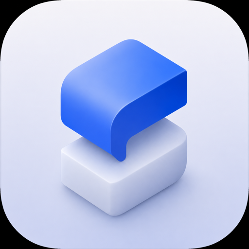

<div align="center">



# solidifai

### Agentic parametric CAD: design real 3D parts by chatting with the coding agent you already use.

[](#status--roadmap)
[](https://github.com/itsJeremyMax/solidifai/actions/workflows/ci.yml)
[](#status--roadmap)
[](https://tauri.app)
[](https://threejs.org)
[](https://build123d.readthedocs.io)
[](LICENSE)

</div>

solidifai is a desktop prototyping CAD tool. Open it, drop into an embedded terminal,
and run the CLI harness you already have: **Codex, Claude Code, OpenCode, Gemini CLI,
GitHub Copilot CLI, or Pi**. Describe a part in plain language; the agent writes
[build123d](https://build123d.readthedocs.io) (Python / OpenCascade) through a built-in
MCP server, and the solid renders in a live three.js viewport with dimensions, a model
tree, and parameter sliders you can drag.

> [!NOTE]
> solidifai is a **harness, not an LLM host.** There is no built-in model and no API key
> to paste. The "AI" is whatever agent you already run in your terminal. The app's job is
> to pre-provision the workspace with everything that agent needs, and to own the CAD
> engine and renderer so the agent and the UI share one source of truth.

---

## Table of contents

- [The magic moment](#the-magic-moment)
- [Why solidifai](#why-solidifai)
- [Features](#features)
- [How it works](#how-it-works)
- [Quick start](#quick-start)
- [The loop](#the-loop)
- [Workspaces](#workspaces)
- [Supported agents](#supported-agents)
- [Tech stack](#tech-stack)
- [Project layout](#project-layout)
- [Status & roadmap](#status--roadmap)
- [Releases & updates](#releases--updates)
- [Contributing](#contributing)
- [License](#license)

## The magic moment

> Open the app. An embedded terminal is waiting in a ready-to-go workspace. Type `codex`
> (or `claude`, `opencode`, `gemini`, `copilot`, or `pi`) and say *"make a 20mm cube with a
> 5mm hole through the top."*
> Within seconds a clean cube with a bored hole appears in the viewport, dimensioned
> `20 × 20 × 20 mm`, with a parameter slider you can drag to re-run the model live.

No new modeling language to learn. You bring the CLI you use; solidifai configures its
workspace integration but does not install any CLI or extension for you. You talk; it builds.

## Why solidifai

Most "AI CAD" tools bolt a chat box onto a modeler and ship their own model behind it.
solidifai inverts that:

- **Bring your own agent.** Use the CLI agent you already trust and pay for. solidifai
  never proxies your prompts or holds your keys.
- **Workspaces come pre-wired.** Every workspace receives managed MCP adapters for all six
  supported harnesses, plus their native instruction pointers and skill roots, so the agent
  already knows the modeling conventions, available tools, and recovery steps. solidifai
  does not install a harness CLI or Pi extension.
- **One render path.** The app owns a long-lived CAD engine, so what the agent builds,
  what you see, and what you export are byte-for-byte the same geometry.
- **Real CAD output.** Parts are genuine B-rep solids (OpenCascade), exportable to STEP
  for downstream CAD or STL for printing, not throwaway meshes.

## Features

- **Natural-language parametric modeling** through your existing CLI agent.
- **Live 3D viewport** (three.js) with studio lighting, soft shadows, and ambient
  occlusion. Geometry updates the instant the agent rebuilds.
- **Dimensions, model tree, and editable parameter sliders.** Drag a parameter and the
  model re-runs without another prompt.
- **Measure tool** and **multi-part exploded views** for inspecting assemblies.
- **Capture views and contact sheets.** The agent can render any camera angle (or a tiled
  all-angles overview) to *see* its own work and self-correct.
- **Versioned history.** Every build is committed to a git-backed timeline, with
  undo / redo and jump-to-any-state.
- **Export to STEP, STL, glTF/GLB, BREP, or 3MF**, each with full format options.
- **Multi-agent.** Codex, Claude Code, OpenCode, Gemini CLI, GitHub Copilot CLI, and Pi
  all have native workspace adapters.
- **Multiple named workspaces** with a launcher; each is a real folder you can put
  under git.

## How it works

```text
Terminal (xterm) ── keystrokes via PTY channel ─────────────┐
PTY host ── spawns your selected supported CLI harness ┘
                       │ agent calls MCP tools (stdio)
                       ▼
solidifai-cad MCP bridge ── local RPC ──┐
                                         ▼
   ENGINE service  (Python · build123d · warm OCP process)  ◀── UI: sliders / export / render
        │  writes  model.glb + model.json   (atomic .tmp → rename)
        ▼
   Artifact watcher (Rust · notify + debounce) ── emits `model-updated`
        ▼
   3D viewport + inspector (three.js · dimensions · tree · sliders · measure)
```

- **Tauri app (Rust)** is the harness: window/UI host, PTY host, engine supervisor,
  artifact watcher, and workspace provisioner.
- **App-owned engine (Python)** is one long-lived `build123d` process (OCP import is slow,
  so it stays warm) that serves *both* the agent and the UI through an identical render
  path, over newline-delimited JSON-RPC on a local socket (a Unix domain socket;
  token-authenticated loopback TCP on Windows).
- **MCP bridge (`solidifai-cad`)** is spawned by the agent inside the terminal; it forwards
  tool calls to the engine socket but doesn't import build123d itself, so agent startup is
  instant and there's a single source of truth for geometry.
- **Watcher (Rust)** streams GLB bytes + `model.json` to the viewport; a monotonic
  `buildId` means stale writes are ignored.

The agent's tool surface (`solidifai-cad` MCP server) includes `execute_script`,
`set_params`, `inspect_features` / `set_feature`, `capture_views`, `get_model_info`, and
`export`, all documented for the agent in the workspace's own instructions and skills.

## Quick start

### Prerequisites

| Tool | For |
|------|-----|
| **Node + [pnpm](https://pnpm.io)** | the frontend (React 19 + Vite + Tailwind v4) |
| **[Rust](https://rustup.rs) (stable)** | the Tauri 2 backend |
| **[uv](https://docs.astral.sh/uv/)** | provisions and runs the Python engine |
| A CLI harness | At least one of **Codex**, **Claude Code**, **OpenCode**, **Gemini CLI**, **GitHub Copilot CLI**, or **Pi** |

> You do **not** need to install build123d yourself. On first run the app runs `uv sync`
> against `engine/` to provision the engine virtualenv (downloads the `cadquery-ocp`
> wheel, ~50 MB, once; cached thereafter). The engine-status pill in the top bar reflects
> `provisioning → ready · py3.x · build123d x.y.z`.

### Run

```sh
pnpm install
pnpm tauri dev
```

This builds the frontend, launches the Tauri window, and starts the engine supervisor on
a background thread; the window paints immediately while the engine provisions.

## The loop

1. Open the app and create or pick a workspace; wait for the engine-status pill to read
   **ready**.
2. In the **Terminal**, run your harness CLI: `codex` (or `claude`, `opencode`, `gemini`,
   `copilot`, or `pi`). The workspace is already provisioned with the MCP server, skills,
   and instructions for every supported harness. If you use Pi, first run
   `pi install npm:pi-mcp-extension` once to enable its MCP tools; solidifai does not install
   that extension.
3. Ask for a part: *"make a 20mm cube with a 5mm hole through the top."*
4. The agent writes build123d code through the MCP tool; the engine renders; the viewport
   updates. Drag the generated parameter slider to iterate live, or just ask for changes.
5. Export to **STEP / STL / glTF / BREP / 3MF** when you're happy.

## Workspaces

A workspace is a real folder on disk. The launcher lists your workspaces as cards and lets
you create new ones anywhere you choose. Each workspace is provisioned idempotently on open
(only writing files that are absent or app-owned) and contains:

- **`model.py`**, the durable, real model script the agent iterates on. It's yours: commit
  it, diff it, hand-edit it.
- **Native agent adapters + skills**: on every workspace, solidifai writes its managed
  adapter files for all six supported harnesses once the engine interpreter is ready. It also
  writes the embedded skill library (`using-solidifai`, `solidifai-modeling`,
  `solidifai-debugging`, plus skills for product design, assemblies, grounding, and
  fabrication) into each harness's native skill root. Existing user-owned files are preserved.
  See [Supported agents](#supported-agents) for the exact paths.
- **`.solidifai/`** holds the runtime files: the watched artifacts (`model.glb` +
  `model.json`), the engine socket, the git-backed history, and scratch/export dirs.

## Supported agents

solidifai writes its managed adapter configuration for every row below into every workspace;
it does not install any of these CLIs. MCP configuration is written after the app resolves its
engine interpreter, while the Claude Code and Gemini CLI instruction pointers are available
even before that first engine launch.

| Harness | Native MCP config | Native instructions and skill path |
|---------|-------------------|------------------------------------|
| [Codex](https://developers.openai.com/codex/cli/) | `.codex/config.toml` | `AGENTS.md`; `.agents/skills/` |
| [Claude Code](https://www.claude.com/product/claude-code) | `.mcp.json`; `.claude/settings.json` | `CLAUDE.md` → `AGENTS.md`; `.claude/skills/` |
| [OpenCode](https://opencode.ai) | `opencode.json` | `AGENTS.md`; `.opencode/skills/` |
| Gemini CLI | `.gemini/settings.json` | `GEMINI.md` → `AGENTS.md`; `.gemini/skills/` |
| GitHub Copilot CLI | `.github/mcp.json` | `AGENTS.md`; `.agents/skills/` |
| Pi | `.pi/mcp.json` | `AGENTS.md`; `.agents/skills/` |

Pi users must run `pi install npm:pi-mcp-extension` once to enable MCP tools. solidifai does
not install the Pi extension or any harness CLI.

The skills and `AGENTS.md` are generated from canonical templates in
`engine/workspace_templates/`, so adding support for another MCP-capable CLI is mostly a
matter of emitting its config file.

## Tech stack

- **Shell:** [Tauri 2](https://tauri.app) (Rust) for the native window, PTY host, engine
  supervisor, and artifact watcher.
- **Frontend:** React 19 · Vite 6 · Tailwind v4 · [three.js](https://threejs.org) viewport ·
  [xterm.js](https://xtermjs.org) terminal.
- **CAD engine:** Python · [build123d](https://build123d.readthedocs.io) on OpenCascade
  (`cadquery-ocp`), provisioned with [uv](https://docs.astral.sh/uv/).
- **Agent interface:** [Model Context Protocol](https://modelcontextprotocol.io) over stdio.

## Project layout

```text
solidifai/
├── src/                       # React frontend (viewport, inspector, terminal, launcher)
│   ├── components/            # UI: Viewport, Inspector, TerminalPane, TopBar, …
│   └── hooks/scene/           # three.js scene: lighting, materials, grid, postprocessing
├── src-tauri/                 # Rust harness
│   └── src/                   # engine supervisor, pty, watcher, provision, workspaces
├── engine/                    # Python CAD engine
│   ├── solidifai_engine/      # warm build123d service (render, features, history, export)
│   ├── solidifai_mcp/         # the solidifai-cad MCP bridge
│   └── workspace_templates/   # AGENTS.md + skills provisioned into every workspace
└── docs/                      # design specs & implementation plans
```

## Status & roadmap

solidifai is an **early MVP**, developed and validated on macOS. It ships installers for
macOS, Windows, and Linux (see [Releases & updates](#releases--updates)), and also runs
from a dev checkout via `pnpm tauri dev`. Known remaining work before a stable public
release:

- **Signing & notarization**: Developer-ID signing and notarization for distributable
  macOS builds (entitlements are wired; the signing identity is left to the release env).
- **Hardening**: a tightened production CSP and scoped capabilities.
- **More platforms**: the release pipeline already produces Windows and Linux installers,
  but macOS is the only platform validated end-to-end today. Engine bundling and testing
  on Windows/Linux are the remaining work.

See [`docs/`](docs/) for the full design spec and milestone plans.

## Releases & updates

Releases are automated. Conventional Commits on `main` drive
[release-please](https://github.com/googleapis/release-please), which opens a
Release PR; merging it builds installers for macOS (Apple Silicon +
Intel), Windows, and Linux, verifies the full asset set, and publishes the
release and updater manifest atomically. A release is never visible with
platforms missing. Updater payloads are minisign-signed; OS code signing and
notarization are not wired yet. (macOS is the validated platform today; see
[Status & roadmap](#status--roadmap).)

### Which file do I download?

Grab the newest version from the
[releases page](https://github.com/itsJeremyMax/solidifai/releases/latest):

| You are on | Download |
|---|---|
| macOS (Apple Silicon) | `solidifai_X.Y.Z_aarch64.dmg` |
| macOS (Intel) | `solidifai_X.Y.Z_x64.dmg` |
| Windows | `solidifai_X.Y.Z_x64-setup.exe`, or `_x64-offline-setup.exe` for machines without internet access |
| Debian/Ubuntu | `solidifai_X.Y.Z_amd64.deb` |
| Other Linux | `solidifai_X.Y.Z_amd64.AppImage` (portable, no install) |

The macOS, offline Windows, and Debian installers include the CAD engine and
run without any setup or network. The standard Windows installer and the
AppImage are small downloads that fetch the engine on first launch. Everything
else on a release (`.sig`, `.app.tar.gz`, `latest.json`) is auto-updater
plumbing; `SHA256SUMS.txt` lets you verify a manual download.

> [!NOTE]
> Builds are not yet OS code-signed, so expect a one-time prompt on first launch.
> On macOS, Gatekeeper blocks the app: allow it under **System Settings →
> Privacy & Security → Open Anyway**. On Windows, SmartScreen warns: click
> **More info → Run anyway**.
>
> If macOS instead reports the app as **"damaged"** (no Open Anyway offered),
> clear the quarantine flag on the download and reopen it:
> `xattr -d com.apple.quarantine ~/Downloads/solidifai_*.dmg`

The app updates itself. When a new version is available you see an "Update
available" indicator; how it applies (notify, auto-download, or silent) is
configurable in **Settings → Updates**, along with the Stable/Beta channel. After
an update, the first launch shows a "What's new" screen with everything that
changed since you last ran the app.

Full operator guide and the one-time setup checklist: [`docs/RELEASING.md`](docs/RELEASING.md).

## Contributing

Contributions, issues, and ideas are welcome. See [CONTRIBUTING.md](CONTRIBUTING.md) for
setup, the per-stack gates (typecheck, lint, format, tests for the frontend, engine, and
shell), and the PR flow. A good first step is to run the app locally (see
[Quick start](#quick-start)) and skim the design specs under [`docs/`](docs/).

Every push and pull request runs the full gate in CI (lint, typecheck, tests, plus
dependency and CodeQL scanning). Commits follow
[Conventional Commits](https://www.conventionalcommits.org/) (`type(scope): summary`); a
local hook and CI both enforce it. Please open an issue to discuss larger changes before
sending a PR.

## License

solidifai is licensed under the **[Apache License 2.0](LICENSE)**, a permissive license
that adds an explicit patent grant and patent-retaliation defense on top of MIT-style
freedoms. You're free to use, modify, and redistribute it, including commercially, provided
you preserve the license and attribution notices (see [`NOTICE`](NOTICE)).

Release builds redistribute third-party components under their own licenses, notably
OpenCASCADE Technology (LGPL-2.1 with the Open CASCADE exception) inside the engine
bundle. Each release ships a `THIRD-PARTY-NOTICES.txt` with the full inventory and
license texts, and the engine bundle carries its own copy at its root.
